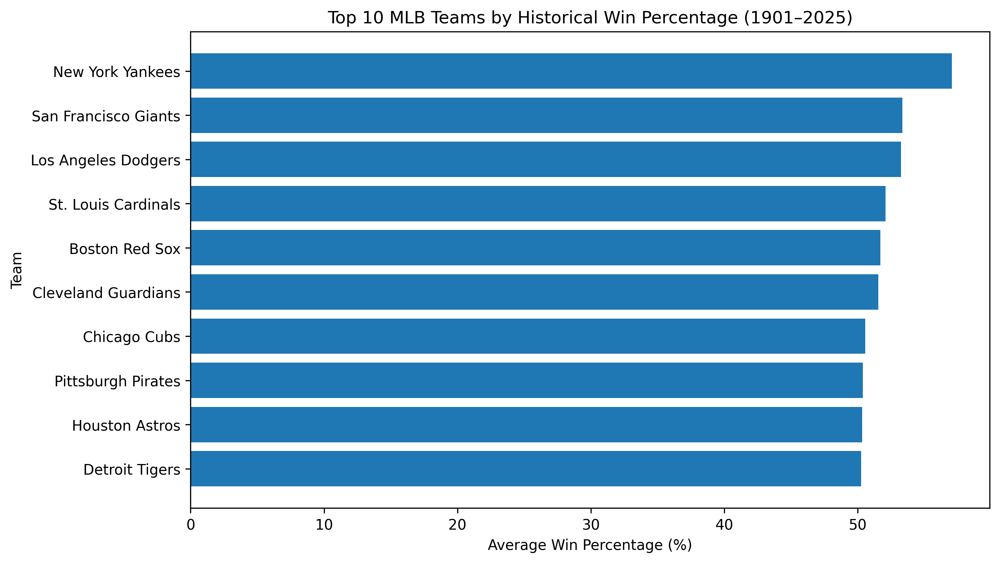
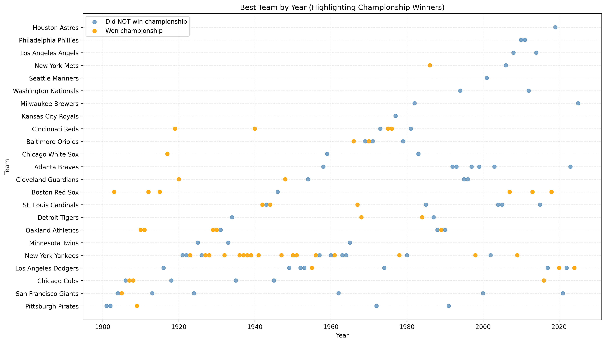
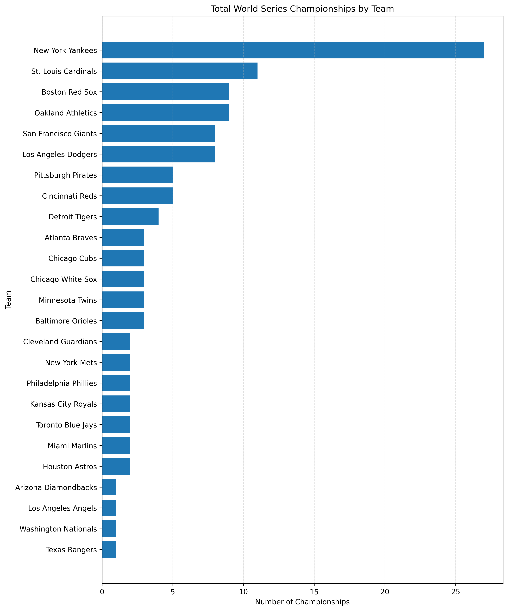
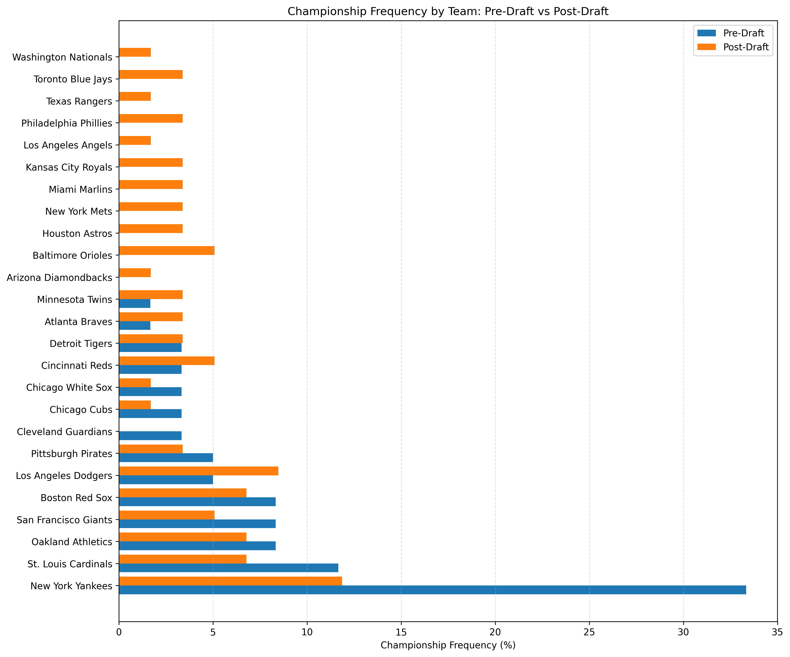

# MLB Historical Analysis: Team Dominance, Championships, and the Impact of the Draft



**End-to-end data analysis of MLB historical performance using Python (Pandas, NumPy, Matplotlib), focused on team dominance, championship distribution, and the impact of the MLB Draft on competitive balance.**

## Overview
This project analyzes more than a century of Major League Baseball data to explore long-term team dominance, championship outcomes, and the impact of the MLB Draft on competitive balance.

The analysis combines historical team performance data with manually compiled datasets for World Series champions and All-Star Game winners. After cleaning and standardizing team names across franchise changes, the project evaluates how success has been distributed over time and whether the introduction of the draft reduced the concentration of dominance among a small number of teams.

## Business / Analytical Questions
This project was designed to answer the following questions:

- Which MLB teams have been the most consistently successful in the regular season?
- How often does the best regular-season team go on to win the World Series?
- Which franchises have won the most championships?
- Did the introduction of the MLB Draft in 1965 reduce long-term dominance and improve competitive balance?
- How has championship frequency changed before and after the draft?
- Is there any visible relationship between the All-Star Game winner and World Series outcomes?

## Dataset
The project uses multiple CSV files stored in the `data/` folder:

- `mlb_stats_1901_to_2025.csv`: main historical MLB dataset
- `2025_stats.csv`: complete 2025 season records used to replace incomplete entries
- `World_Series_Champion.csv`: manually compiled World Series champion data
- `All_Star_Game_Winner.csv`: manually compiled All-Star Game winner data
- `mlb_stats_final.csv`: final cleaned dataset exported after preprocessing

## Tools Used
- Python
- Pandas
- NumPy
- Matplotlib
- Jupyter Notebook

## Data Cleaning and Preparation
The following steps were performed before analysis:

- Removed incomplete 2025 rows from the main dataset
- Replaced them with a complete 2025 dataset
- Standardized all column names
- Merged external championship and All-Star Game datasets
- Standardized historical franchise names to avoid duplicate team identities
- Assigned each team to the correct league
- Reviewed and explained missing values in the championship field
- Exported the cleaned final dataset for easier reuse

## Key Insights

### 1. A small group of franchises has historically dominated MLB
The Yankees, Dodgers, and Braves consistently appear among the strongest teams by average winning percentage. This suggests that long-term regular-season success has been concentrated among a relatively small number of organizations.

### 2. The best regular-season team does not usually win the World Series
The project compares the best team each year with the eventual champion and shows that finishing with the top regular-season record does not guarantee a title. This highlights the uncertainty of postseason baseball and the importance of short-series variance.

### 3. Championship success is unevenly distributed across franchises
A small number of teams account for a large share of total World Series titles, especially in the earlier decades of MLB history.

### 4. The MLB Draft appears to have reduced dominance
Comparing pre-draft and post-draft periods suggests that the distribution of success became more balanced after 1965. Historically dominant franchises still remained competitive, but championship frequency became less concentrated.

### 5. Competitive balance improved in the post-draft era
The post-draft comparison indicates that more teams were able to compete for championships over time, which supports the idea that the draft helped improve parity across the league.

## Project Structure
```bash
mlb-analysis/
│
├── data/
│   ├── 2025_stats.csv
│   ├── All_Star_Game_Winner.csv
│   ├── World_Series_Champion.csv
│   ├── mlb_stats_1901_to_2025.csv
│   └── mlb_stats_final.csv
├── images/
├── mlb_analysis.ipynb
├── README.md
├── requirements.txt
└── .gitignore
```

## Example Visuals
Store your exported charts in an `images/` folder and reference them here.

### Top 10 MLB Teams by Historical Win Percentage


### Did the Best Team Win the World Series?


### Total World Series Championships by Team


### Championship Frequency by Team: Pre-Draft vs Post-Draft


## How to Run the Project
1. Clone this repository
2. Open the notebook in Jupyter
3. Install the required libraries
4. Run the cells from top to bottom

```bash
pip install -r requirements.txt
jupyter notebook
```

## Final Conclusion
This project shows that MLB history has been shaped by both sustained franchise dominance and structural changes that improved parity. While a handful of teams led the league for much of the early modern era, the introduction of the draft appears to have reduced that concentration and made championship success more broadly distributed across teams.

## Author
Jose Peralta
